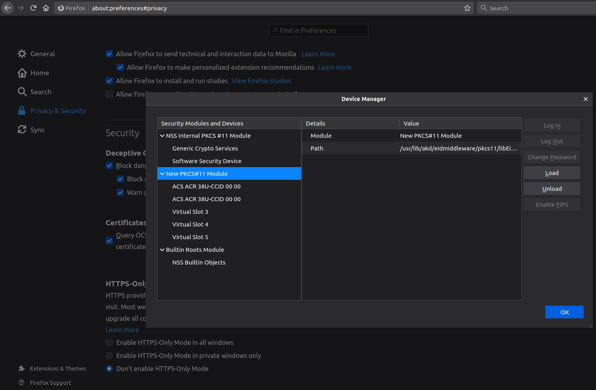

## Debugging

Inspect the content of eidmiddleware:
```bash
$ tree /usr/lib/akd/eidmiddleware/

/usr/lib/akd/eidmiddleware/
├── certificates
│   ├── AKDCARoot.pem   <---------------- ca root certificate
│   └── HRIDCA.pem  <---------------- ca certificate
├── Client  <---------------- identification app
├── lib
│   ├── libp11.so.2
│   ├── libpkcs11.so
│   ├── libQt5Core.so.5
│   ├── libQt5DBus.so.5
│   ├── libQt5Gui.so.5
│   ├── libQt5PrintSupport.so.5
│   ├── libQt5Widgets.so.5
│   └── libQt5XcbQpa.so.5
├── License.bin
├── pkcs11
│   ├── libEidPkcs11.so  <---------------- pkcs11 driver
│   └── libEidPkcs11.so.lic
├── plugins
│   ├── imageformats
│   │   ├── libqjp2.so
│   │   └── libqjpeg.so
│   ├── platforms
│   │   └── libqxcb.so
│   └── printsupport
│       └── libcupsprintersupport.so
├── qt.conf
└── Signer <---------------- signer app
```

I use FER (university usb card reader) ACR38U-A1.

```bash
$ modutil -dbdir sql:$HOME/.pki/nssdb/ -list

Listing of PKCS #11 Modules
-----------------------------------------------------------
  1. NSS Internal PKCS #11 Module
	   uri: pkcs11:library-manufacturer=Mozilla%20Foundation;library-description=NSS%20Internal%20Crypto%20Services;library-version=3.49
	 slots: 2 slots attached
	status: loaded

	 slot: NSS Internal Cryptographic Services
	token: NSS Generic Crypto Services
	  uri: pkcs11:token=NSS%20Generic%20Crypto%20Services;manufacturer=Mozilla%20Foundation;serial=0000000000000000;model=NSS%203

	 slot: NSS User Private Key and Certificate Services
	token: NSS Certificate DB
	  uri: pkcs11:token=NSS%20Certificate%20DB;manufacturer=Mozilla%20Foundation;serial=0000000000000000;model=NSS%203

  2. HR eID
	library name: /usr/lib/akd/eidmiddleware/pkcs11/libEidPkcs11.so
	   uri: pkcs11:library-manufacturer=AKD;library-description=AKD%20eID%20Middleware%20PKCS11;library-version=1.7
	 slots: 5 slots attached
	status: loaded

	 slot: ACS ACR 38U-CCID 00 00  <---------------- my usb card reader (when you plug in your ID you should see here two tokens: `AKD eID Card (Identification)` and `AKD eID Card (Signature)`)
	token: 
	  uri: pkcs11:

	 slot: Virtual Slot 2
	token: 
	  uri: pkcs11:

	 slot: Virtual Slot 3
	token: 
	  uri: pkcs11:

	 slot: Virtual Slot 4
	token: 
	  uri: pkcs11:

	 slot: Virtual Slot 5
	token: 
	  uri: pkcs11:
-----------------------------------------------------------
```

## Firefox supports UI to add certificates and secured devices

Download and import manually certificates to Firefox
- `/usr/lib/akd/eidmiddleware/certificates/*`  (Firefox > View Certificates > Import)
- `/usr/lib/akd/eidmiddleware/pkcs11/libEidPkcs11.so` (Firefox > Security Devices > Load)


