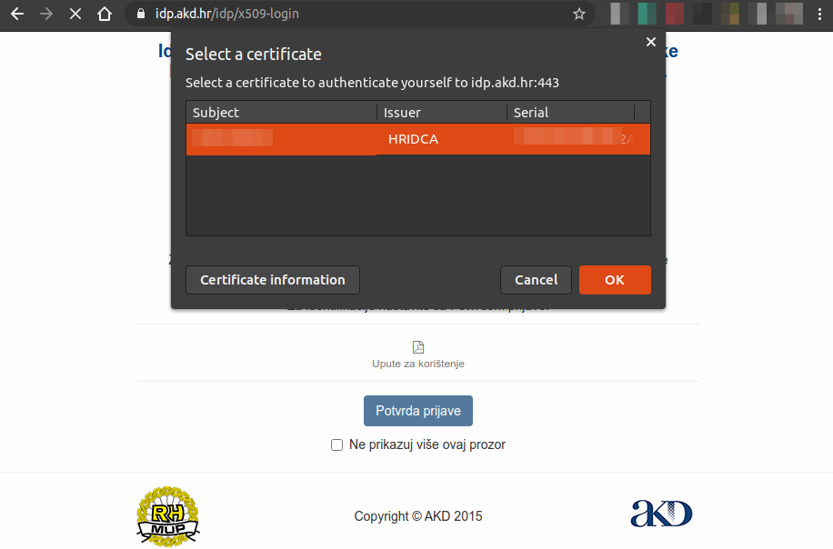
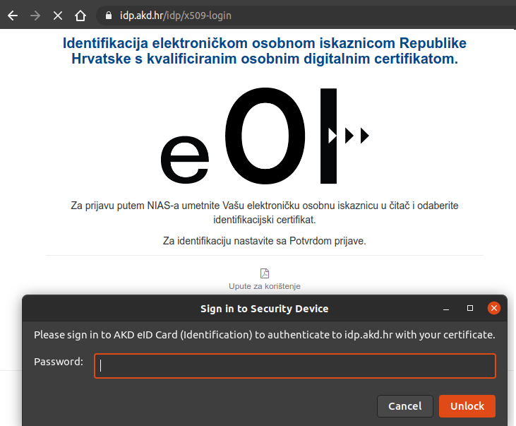
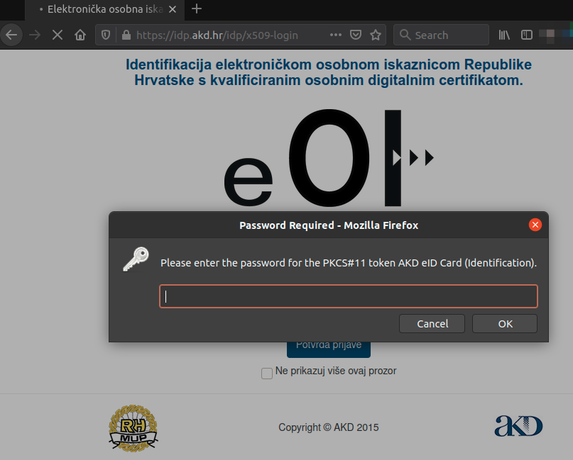
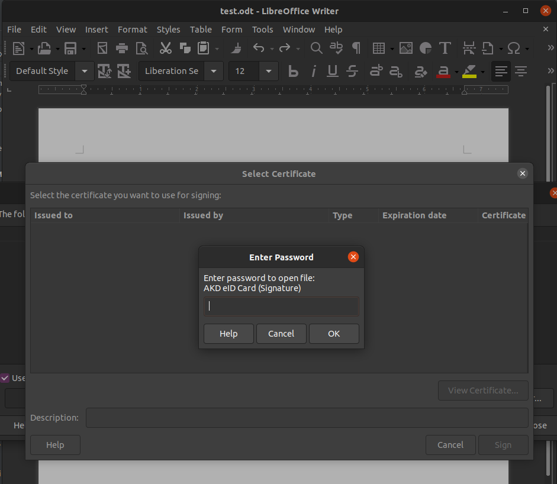
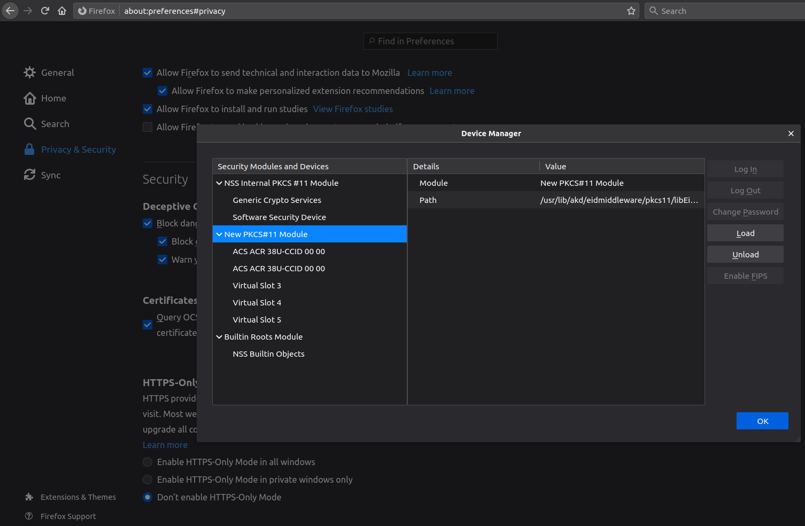

# linux-egradjani

Steps on how to set up the Croatian e-Građani app for identification (Chrome/Firefox) and signing documents (LibreOffice) on Linux (Ubuntu 21.04.)

## Linux requirements

1. Install smart-card reader tooling
    ```bash
    # if on Ubunt 22.04 LTS keep only `pcsc-tools` `opensc` packages and try without others
    # in case modutil is missing install `libnss3-tools` as well  
   sudo apt-get install -y libccid ccid pcsc-tools opensc
    ```

2. Start the service
    ```bash
    sudo systemctl start pcscd.service
    sudo systemctl enable pcscd.service
    ```

## e-egradjani requirements

To use your ID certificates, you must activate your eOI, and check [eid.hr](https://eid.hr/hr/eosobna/clanci/aktiviraj-eoi) for steps.

There you should find the latest linux `.deb` package. For the previous versions check [here](https://eid.hr/hr/eosobna/clanci/ranije-verzije-middlewara).

## Step-by-step

1. Download `eidmiddleware` app that contains all services, certificates, etc.
    ```bash
    sudo dpkg -i eidmiddleware_vX.Y.Z_amd64.deb 
    ```

2. Create a new local NSS db
    ```bash
    rm -rf $HOME/.pki/nssdb
    mkdir -p $HOME/.pki/nssdb
    # if on Ubunt 22.04 LTS skip this command
    sudo chmod 777 /etc/pam_pkcs11/nssdb
    certutil -d $HOME/.pki/nssdb -N --empty-password
    sudo chmod 777 $HOME/.pki/nssdb/pkcs11.txt
    ```

2. Add  the named module `HR eID` to NSS module database with `PKCS #11` implementation libfile
    ```bash
    modutil \
      -dbdir sql:$HOME/.pki/nssdb \
      -add "HR eID" -libfile /usr/lib/akd/eidmiddleware/pkcs11/libEidPkcs11.so \
      -mechanisms FRIENDLY \
      -force 
    ```
   Flag `-mechanisms FRIENDLY` is required to work on Chromium/Chrome,
   check [here](https://bugs.chromium.org/p/chromium/issues/detail?id=42073#c76) for details.

3. Check whether `HR eID` is added to NSS db
    ```bash
    modutil -dbdir sql:$HOME/.pki/nssdb/ -list
    ```

4. Turn on Client and Signer apps.

## Identification

1. Go to [gov.hr](https://gov.hr) and login with eOsobna option
    - Chrome:

         

         

    - Firefox:

         

## Signing documents

To sign documents using `LibreOffice` go to

```
LibreOffice > Tools > Options > Security > Certificate... >  Select NSS path
```

and navigate to folder `$HOME/.pki/nssdb` and press OK and restart LibreOffice. Go to

```
File > Digital Signatures > Digital Signatures... > Sign Document...
```

and pop-ups for Signature/Identification will appear.

<p align="center"></p>

## Debugging

Inspect the content of eidmiddleware:
```bash
$ tree /usr/lib/akd/eidmiddleware/

/usr/lib/akd/eidmiddleware/
├── certificates
│   ├── AKDCARoot.pem   <---------------- ca root certificate
│   └── HRIDCA.pem  <---------------- ca certificate
├── Client  <---------------- identification app
├── lib
│   ├── libp11.so.2
│   ├── libpkcs11.so
│   ├── libQt5Core.so.5
│   ├── libQt5DBus.so.5
│   ├── libQt5Gui.so.5
│   ├── libQt5PrintSupport.so.5
│   ├── libQt5Widgets.so.5
│   └── libQt5XcbQpa.so.5
├── License.bin
├── pkcs11
│   ├── libEidPkcs11.so  <---------------- pkcs11 driver
│   └── libEidPkcs11.so.lic
├── plugins
│   ├── imageformats
│   │   ├── libqjp2.so
│   │   └── libqjpeg.so
│   ├── platforms
│   │   └── libqxcb.so
│   └── printsupport
│       └── libcupsprintersupport.so
├── qt.conf
└── Signer <---------------- signer app
```

I use FER (university usb card reader) ACR38U-A1.

```bash
$ modutil -dbdir sql:$HOME/.pki/nssdb/ -list

Listing of PKCS #11 Modules
-----------------------------------------------------------
  1. NSS Internal PKCS #11 Module
	   uri: pkcs11:library-manufacturer=Mozilla%20Foundation;library-description=NSS%20Internal%20Crypto%20Services;library-version=3.49
	 slots: 2 slots attached
	status: loaded

	 slot: NSS Internal Cryptographic Services
	token: NSS Generic Crypto Services
	  uri: pkcs11:token=NSS%20Generic%20Crypto%20Services;manufacturer=Mozilla%20Foundation;serial=0000000000000000;model=NSS%203

	 slot: NSS User Private Key and Certificate Services
	token: NSS Certificate DB
	  uri: pkcs11:token=NSS%20Certificate%20DB;manufacturer=Mozilla%20Foundation;serial=0000000000000000;model=NSS%203

  2. HR eID
	library name: /usr/lib/akd/eidmiddleware/pkcs11/libEidPkcs11.so
	   uri: pkcs11:library-manufacturer=AKD;library-description=AKD%20eID%20Middleware%20PKCS11;library-version=1.7
	 slots: 5 slots attached
	status: loaded

	 slot: ACS ACR 38U-CCID 00 00  <---------------- my usb card reader (when you plug in your ID you should see here two tokens: `AKD eID Card (Identification)` and `AKD eID Card (Signature)`)
	token: 
	  uri: pkcs11:

	 slot: Virtual Slot 2
	token: 
	  uri: pkcs11:

	 slot: Virtual Slot 3
	token: 
	  uri: pkcs11:

	 slot: Virtual Slot 4
	token: 
	  uri: pkcs11:

	 slot: Virtual Slot 5
	token: 
	  uri: pkcs11:
-----------------------------------------------------------
```

## Firefox supports UI to add certificates and secured devices

Download and import manually certificates to Firefox
- `/usr/lib/akd/eidmiddleware/certificates/*`  (Firefox > View Certificates > Import)
- `/usr/lib/akd/eidmiddleware/pkcs11/libEidPkcs11.so` (Firefox > Security Devices > Load)



## References

- https://www.eid.hr/hr
- https://hr.comp.os.linux.narkive.com/7ObBGSco/eoi-na-ubuntu (Thanks!)
- https://bugs.chromium.org/p/chromium/issues/detail?id=42073
- https://www.suse.com/c/configuring-smart-card-authentication-suse-linux-enterprise/
