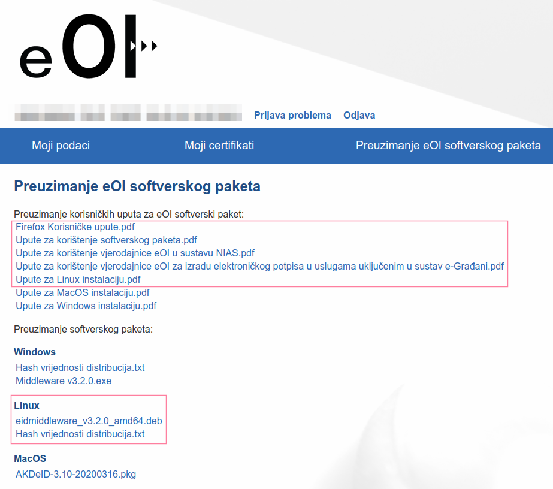

# linux-egradjani

Steps on how-to setup e-Građani app for identification (Chrome/Firefox) and signing documents (LibreOffice) on Linux (Ubuntu 21.04.)

## Linux requirements

1. Install smart-card reader tooling
    ```bash
    sudo apt-get install -y libccid ccid pcsc-tools opensc
    # if on Ubunt 22.04 LTS remove keep only pcsc-tools opensc packages and try without others
    ```

2. Start the service
    ```bash
    sudo systemctl start pcscd.service
    sudo systemctl enable pcscd.service
    ```

## e-Građani requirements

In order to use your ID certificates, you have to activate your eOI, check [eid.hr](https://eid.hr/hr) for steps.

Visit [eoi.akd.hr](https://eoi.akd.hr) and sign in with your eOI credentials (OIB/Password) you got from MUP RH when
issuing your ID.

When you get signed in, check `Preuzimanje eOI softverskog paketa` page for linux version of `eidmiddleware`.

<p align="center"></p>

## Step-by-step

1. Download `eidmiddleware` app that contains all services, certificates, etc.
    ```bash
    sudo dpkg -i eidmiddleware_vX.Y.Z_amd64.deb 
    ```

2. Create a new local NSS db
    ```bash
    rm -rf $HOME/.pki/nssdb
    mkdir -p $HOME/.pki/nssdb
    certutil -d $HOME/.pki/nssdb -N
    sudo chmod 777 $HOME/.pki/nssdb/pkcs11.txt
    ```

2. Add  the named module `HR eID` to NSS module database with `PKCS #11` implementation libfile
    ```bash
    modutil -dbdir sql:$HOME/.pki/nssdb -add "HR eID" -libfile /usr/lib/akd/eidmiddleware/pkcs11/libEidPkcs11.so -mechanisms FRIENDLY -force 
    ```
   Flag `-mechanisms FRIENDLY` is required to work on Chromium/Chrome,
   check [here](https://bugs.chromium.org/p/chromium/issues/detail?id=42073#c76) for details.

3. Check whether `HR eID` is added to NSS db
    ```bash
    modutil -dbdir sql:$HOME/.pki/nssdb/ -list
    ```

4. Turn on Client and Signer apps.

## Identification

1. Go to [gov.hr](https://gov.hr) and login with eOsobna option
    - Chrome:

         

         

    - Firefox:

         

## Signing documents

To sign documents using `LibreOffice` go to

```
LibreOffice > Tools > Options > Security > Certificate... >  Select NSS path
```

and navigate to folder `$HOME/.pki/nssdb` and press OK and restart LibreOffice. Go to

```
File > Digital Signatures > Digital Signatures... > Sign Document...
```

and pop-ups for Signature/Identification will appear.

<p align="center"></p>

## References

For Debugging check [DEBUG.md](DEBUG.md)

- https://www.eid.hr/hr
- https://hr.comp.os.linux.narkive.com/7ObBGSco/eoi-na-ubuntu (Thanks!)
- https://bugs.chromium.org/p/chromium/issues/detail?id=42073

